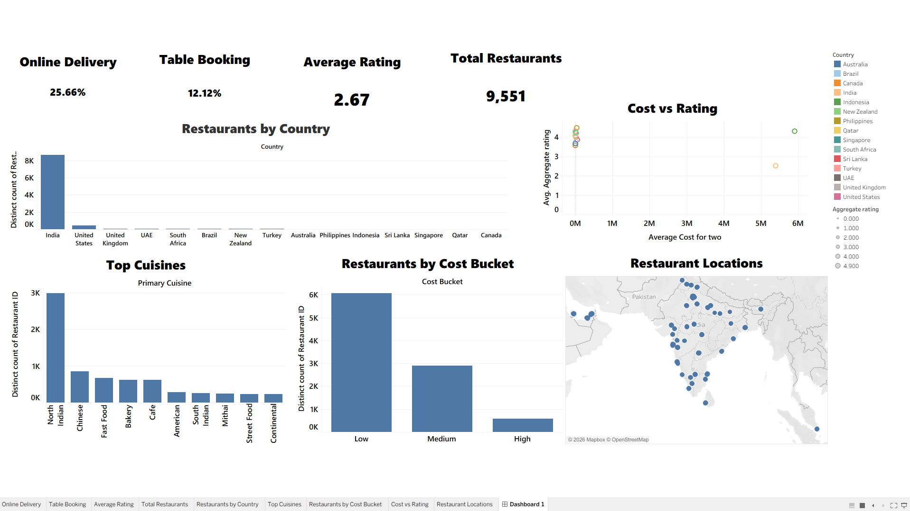

# Zomato Restaurant Analysis Dashboard

An interactive Tableau dashboard developed to analyze Zomato restaurant data and explore restaurant distribution, cuisines, pricing, ratings, online delivery, table booking, and geographical locations.

## Dashboard Preview



## Project Overview

This project uses Tableau to transform Zomato restaurant data into an interactive analytical dashboard.

The dashboard provides a visual overview of restaurant trends across different countries, cuisines, cost categories, ratings, and locations. It also presents key metrics related to online delivery and table booking.

## Key Metrics

- **Online Delivery:** 25.66%
- **Table Booking:** 12.12%
- **Average Rating:** 2.67
- **Total Restaurants:** 9,551

## Dashboard Features

### Restaurants by Country
Shows the distribution of restaurants across different countries and highlights the countries with the highest number of restaurants.

### Top Cuisines
Displays the most common primary cuisines based on restaurant count.

### Restaurants by Cost Bucket
Groups restaurants into three cost categories:

- Low
- Medium
- High

### Cost vs Rating
Compares the average cost for two with restaurant ratings to explore the relationship between restaurant pricing and ratings.

### Restaurant Locations
Uses geographical data such as latitude and longitude to visualize restaurant locations on a map.

### Online Delivery
Shows the percentage of restaurants that provide online delivery.

### Table Booking
Shows the percentage of restaurants that provide table booking services.

## Dataset

The project uses a Zomato restaurant dataset containing restaurant and location-related information, including:

- Restaurant ID
- Restaurant Name
- Country
- City
- Address
- Locality
- Longitude
- Latitude
- Cuisines
- Average Cost for Two
- Currency
- Table Booking
- Online Delivery
- Price Range
- Aggregate Rating
- Rating Text
- Votes
- Primary Cuisine

## Key Insights

- India has the highest number of restaurants in the dataset.
- North Indian is the most common primary cuisine displayed in the dashboard.
- Most restaurants fall within the Low and Medium cost categories.
- The Cost vs Rating visualization compares restaurant pricing with aggregate ratings.
- Restaurant locations are visualized using geographical coordinates.
- The dashboard provides an overview of online delivery and table booking availability.

## Tools & Technologies

- **Tableau**
- **Data Analysis**
- **Data Visualization**
- **Dashboard Development**
- **Zomato Restaurant Dataset**
- **CSV Dataset**

## Tableau Visualizations

The workbook contains the following worksheets:

- Average Rating
- Cost vs Rating
- Online Delivery
- Restaurant Locations
- Restaurants by Cost Bucket
- Restaurants by Country
- Table Booking
- Top Cuisines
- Total Restaurants

These worksheets are combined into the final **Dashboard 1** dashboard.

## Author

**Akhil Nasim N**

B.Sc. Computer Science Graduate | Aspiring Data Analyst

Skills: Tableau, Power BI, Excel, Python, SQL, Data Analysis, Data Visualization

## Project Structure

```text
Zomato-Restaurant-Analysis-Tableau/
│
├── README.md
├── Dashboard.png
├── Zomato_Restaurant_Dataset(2).twb
└── Zomato_Restaurant_Dataset.csv
